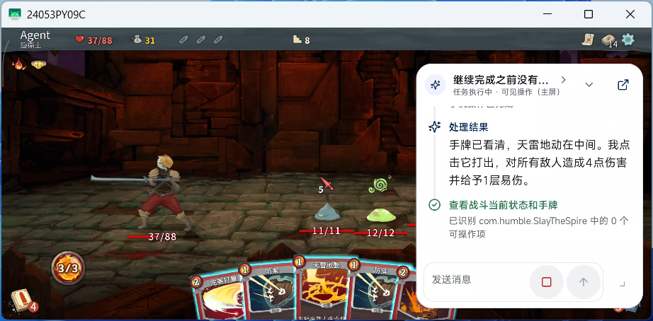
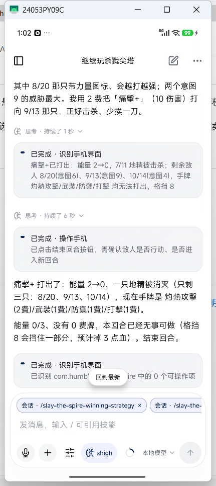
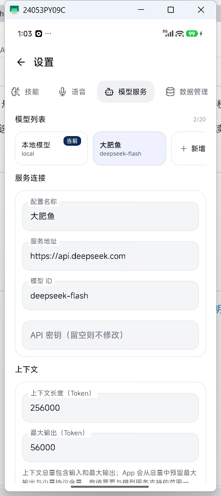
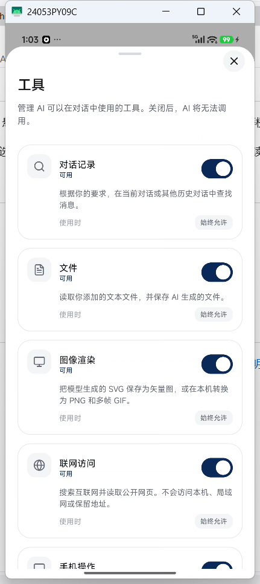
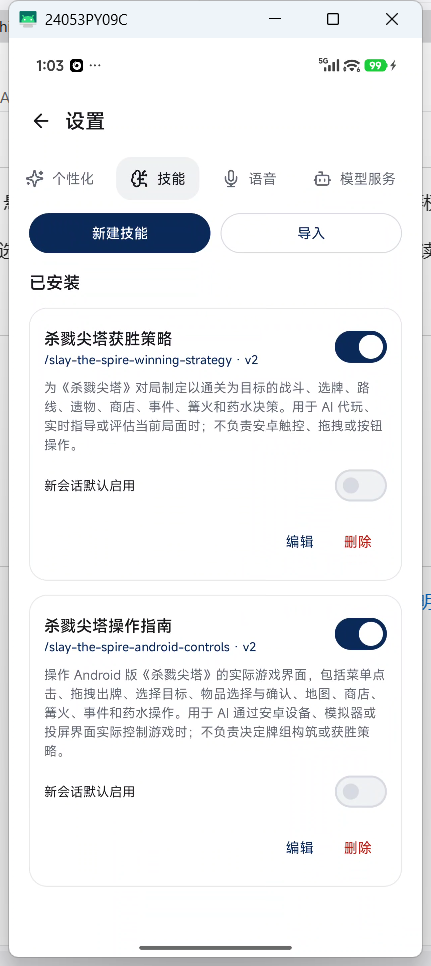

# Mobile Agent

[English](README.md) | [简体中文](README.zh-CN.md)

Mobile Agent is an open-source AI chat and local-tool application for Android. It lets users access file, network, and device capabilities through ongoing conversations, with explicit approval before sensitive actions are performed.

> This project is in an early stage of development. Its APIs, data structures, and interactions may still change. Use it on a test device first, and do not use it for payments or account-security operations.

## In Action

<table>
  <tr>
    <td align="center">
       
      Skill-guided game control
    </td>
    <td align="center">
       
      Configurable model services
    </td>
  </tr>
  <tr>
    <td align="center">
       
      Per-tool capability controls
    </td>
    <td align="center">
       
      Skill installation and management
    </td>
  </tr>
</table>

## Key Features

- Multi-turn conversations, context compression, and model usage statistics.
- Support for OpenAI-compatible model services with configurable endpoints, models, and API keys.
- Speech transcription through OpenAI-compatible and iFLYTEK-compatible services.
- Reading and managing files, images, webpages, and generated artifacts.
- Optional Root/accessibility-based device control, a floating assistant, and permission controls.

## Roadmap

The project is continuously being updated...

## Permissions and Data Boundaries

Mobile Agent may request access to the microphone, notifications, display-over-other-apps, startup after device boot, the installed-app list, installing updates, and accessibility services. Root access, accessibility services, screenshots, and external model calls are highly privileged capabilities and should only be used after the user explicitly enables or approves them.

Model requests, speech transcription, and webpage access may send user-selected content to the corresponding third-party services. Read the [Privacy Notice](PRIVACY.md) before installing or using the app.

## Project Documentation

- [Product Definition](docs/PRODUCT.md)
- [Design Guidelines](docs/DESIGN.md)
- [Technical Architecture](docs/ARCHITECTURE.md)
- [Implementation Plan](docs/PLAN.md)
- [Third-Party Notices](THIRD_PARTY_NOTICES.md)

The detailed engineering documents currently remain in Chinese.

## License

Mobile Agent's own source code is licensed under the [Apache License 2.0](LICENSE). Third-party components remain subject to their respective licenses. See [Third-Party Notices](THIRD_PARTY_NOTICES.md) and the `licenses/` directory for details.
